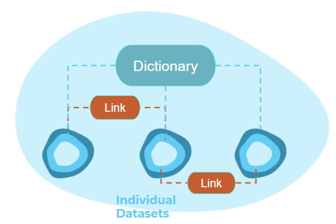

# Power Station Dictionary

> The *Power Station Dictionary* is a [site](https://osuked.github.io/Power-Station-Dictionary/) that enables mapping between various power plant ids and automatically extracts data relating to those plants from Frictionless Data packages.

N.b. This project is currently in active development.

<br>
<br>

### Motivation

Existing work into increasing the visibility of energy data has focused on improving the ability of humans to find datasets, which has historically been a key issue within a highly fragmented energy data landscape. Groups such as the Energy Data Taskforce have prompted a new wave of metadata standardisation and data cataloguing initiatives which have gone a long way to solving this issue, opening up new opportunities such as the creation of digital twins of the power grid. However, these new opportunities bring new challenges. To enable a digital twin of the energy system we need to be able to ["describe relationships between assets and datasets"](https://docs.google.com/document/d/1X8PIP4f0K2abKjyQiGJQaxdcflQ36GeATBfhJqFevxA), requiring two core extensions to our existing toolset:

1. Field-level metadata that describes the contents of individual columns in a dataset
2. "Mapping" datasets that are able to express the relationships between other datasets



These additions enable us to move from improving the ability of humans to discover datasets to making it easier for machines to automatically find and extract relevant data - a need that will only increase as the number and size of datasets continues to grow. The benefits extend beyond our digital colleagues though - by pivoting data exploration to be about finding objects/assets, which then reveal the datasets (and attributes) they are linked to, we can create a more intuitive search experience. Similar to Google’s move from searching for ["Things not Strings"](https://blog.google/products/search/introducing-knowledge-graph-things-not/), the data dictionary lets us search for "Assets not Datasets".

To illustrate the benefits of such a framework we are building a pilot dictionary focused on improving the discoverability, linkage, and automated extraction of data relating to power stations on the GB system. Power stations were chosen due to the high number of datasets they relate to, the wide range of ids used to describe them, and the current duplication in efforts to link them across industry and academia. We will then demonstrate how the dictionary can be used for analysis with two case studies: one researching the carbon intensity of individual generators by matching power output and carbon emission datasets, the second linking wholesale price and renewable subsidy data to help explain why wind subsidies have fallen below the average market price.

<br>
<br>

### Dictionary Framework

##### Dictionary Schema & Core Dataset

The dictionary is composed of two files, a [csv containing ids](https://raw.githubusercontent.com/OSUKED/Power-Station-Dictionary/shiro/data/dictionary/ids.csv) that relate to different power stations and a [json containing metadata](https://raw.githubusercontent.com/OSUKED/Power-Station-Dictionary/shiro/data/dictionary/datapackage.json) written as an extension to the [Frictionless Data Tabular schema](https://specs.frictionlessdata.io/table-schema/). "Frictionless Data (FD) is an open-source toolkit that brings simplicity to the data experience" through an open-source standard that defines a specification for describing metadata relating to different types of datasets. Once a dataset has been described using the specification it then becomes incredibly easy to load it using different programming languages as well as export it into a wide range of different formats. What makes FD different to most other specifications is that they provide a comprehensive way to describe individual columns within a dataset, including their formats and constraints.

The majority of the schema is the same as the Tabular Schema published by FD. The core change is the use of `foreignKeys` to link to external datasets that use ids specified in the dictionary, a separate `attributes` entry then describes the columns which should be extracted from the dataset. The `hierarchy` attribute for each column then describes whether the ids in that column have a `same-as` or `part-of` relationship with the asset they’re linked to. A further `url_format` entry then provides a way to convert specific IDs into urls (e.g. with wikidata ids).

The datasets linked to the dictionary must be described using the FD tabular schema, however, the metadata does not need to be stored adjacent to the raw source and could be generated by a third party rather than the original data provider. Data-providers from within the energy sector already using this format include [Public Utility Data Library](https://catalyst.coop/pudl/) and [Open Power System Data](https://open-power-system-data.org/). As well as being able to link into the dictionary by publishing your datasets using this standard you can make use of a [wider ecosystem of data tools](https://frictionlessdata.io/software/).

<br>

##### Building the Knowledge Graph/Website

Once the dictionary has been created a Python library then uses it to programmatically identify the different assets it contains, and then extract data relating to those assets from the datasets linked to the dictionary. The generation steps are as follows:

1. Each row of the dictionary is iterated over with the associated ids extracted for each asset
2. The datasets linked to the dictionary which contain an id relating to the current asset are identified
3. The relevant attributes for each asset which are contained in the linked datasets are then extracted
4. For each asset the outputted linked ids, datasets, and attributes are then used to populate a markdown template which forms the basis of a webpage within the dictionary site


<br>
<br>

### Installation

To install the `powerdict` library please run:

```bash
pip install powerdict
```

<br>

### Development Set-Up

To set-up a new environment you can run the following from the batch_scripts directory

```bash
setup_env
```

Alternatively you can run these commands

```bash
call conda env create -f environment.yml
call conda activate PowerDict
call ipython kernel install --user --name=PowerDict
```

<br>

### Publishing to PyPi

To publish the `powerdict` module to PyPi simply run the following from the batch_scripts directory

```bash
pypi_publish
```

or follow these commands

```bash
call conda activate PowerDict
call python setup.py sdist bdist_wheel
call twine upload --skip-existing dist/*
```

When prompted you should enter your PyPi username and password

After this you will be able to install the latest version of powerdict using `pip install powerdict`
