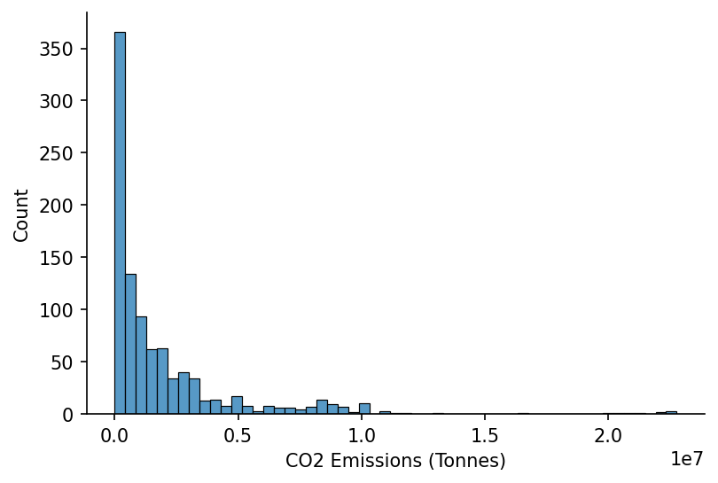
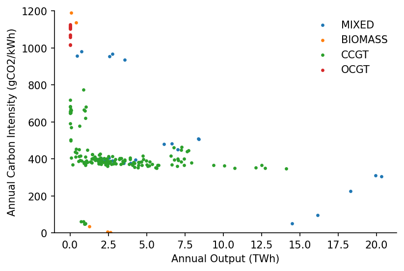

# Carbon Intensity


```python
import numpy as np
import pandas as pd

import seaborn as sns
import matplotlib.pyplot as plt
```

<br>

### Data Preparation

We'll start by loading the dictionary’s attribute data. This data has been automatically extracted from other datasets which have been linked to assets in the dictionary.

```python
attributes_fp = 'https://osuked.github.io/Power-Station-Dictionary/object_attrs/dictionary_attributes.csv'

df_attrs = pd.read_csv(attributes_fp)

df_attrs.head()
```


| attribute           | id     | value      | datapackage                                       | id_type       |   year |   dictionary_id |   financial_year |
|:--------------------|:-------|:-----------|:--------------------------------------------------|:--------------|-------:|----------------:|-----------------:|
| Fuel Type           | MARK-1 | BIOMASS    | https://raw.githubusercontent.com/OSUKED/Dicti... | ngc_bmu_id    |    nan |           10000 |              nan |
| Longitude           | 10000  | -3.603516  | https://raw.githubusercontent.com/OSUKED/Dicti... | dictionary_id |    nan |           10000 |              nan |
| Latitude            | 10000  | 57.480403  | https://raw.githubusercontent.com/OSUKED/Dicti... | dictionary_id |    nan |           10000 |              nan |
| Annual Output (MWh) | MARK-1 | 355704.933 | https://raw.githubusercontent.com/OSUKED/Dicti... | ngc_bmu_id    |   2016 |           10000 |              nan |
| Annual Output (MWh) | MARK-1 | 387311.364 | https://raw.githubusercontent.com/OSUKED/Dicti... | ngc_bmu_id    |   2017 |           10000 |              nan |</div>


<br>

We'll then extract the CO2 emissions data

```python
def hide_spines(ax, positions=["top", "right"]):
    """
    Pass a matplotlib axis and list of positions with spines to be removed
    
    args:
        ax:          Matplotlib axis object
        positions:   Python list e.g. ['top', 'bottom']
    """
    assert isinstance(positions, list), "Position must be passed as a list "

    for position in positions:
        ax.spines[position].set_visible(False)
```

```python
co2_attr = 'CO2 Emissions (Tonnes)'

s_site_co2 = (
    df_attrs
    .query('attribute==@co2_attr')
    [['dictionary_id', 'year', 'value']]
    .dropna()
    .astype({'dictionary_id': int, 'year': int, 'value': float})
    .groupby(['dictionary_id', 'year'])
    ['value']
    .sum()
)

# Plotting
fig, ax = plt.subplots(dpi=150)

sns.histplot(s_site_co2, ax=ax)

ax.set_xlabel(co2_attr)
hide_spines(ax)
```





<br>

As well as the power output data

```python
output_attr = 'Annual Output (MWh)'

s_site_output = (
    df_attrs
    .query('attribute==@output_attr')
    [['dictionary_id', 'year', 'value']]
    .dropna()
    .astype({'dictionary_id': int, 'year': int, 'value': float})
    .groupby(['dictionary_id', 'year'])
    ['value']
    .sum()
)

# Plotting
fig, ax = plt.subplots(dpi=150)

sns.histplot(s_site_output, ax=ax)

ax.set_xlabel(output_attr)
hide_spines(ax)
```


<br>

And lastly the fuel types of each plant

```python
fuel_attr = 'Fuel Type'

s_site_fuel_type = (
    df_attrs
    .query('attribute==@fuel_attr')
    [['dictionary_id', 'value']]
    .dropna()
    .astype({'dictionary_id': int, 'value': str})
    .groupby('dictionary_id')
    ['value']
    .agg(lambda fuel_types: ', '.join(set(fuel_types)))
)

s_site_fuel_type.value_counts()
```


    WIND                   112
    CCGT                    34
    NPSHYD                  13
    NUCLEAR                  7
    OCGT                     4
    PS                       4
    CCGT, OCGT               3
    BIOMASS                  3
    COAL, OCGT               1
    CCGT, COAL, OCGT         1
    Wind                     1
    BIOMASS, OCGT, COAL      1
    OTHER                    1
    Name: value, dtype: int64


<br>

### Calculating Annual Carbon Intensities

We'll quickly check the data coverage

```python
sites_with_co2_data = s_site_co2.index
sites_with_output_data = s_site_output.index

sites_with_both_datasets = sites_with_co2_data.intersection(sites_with_output_data)

sites_with_co2_data.size, sites_with_output_data.size, sites_with_both_datasets.size
```


    (978, 825, 239)


```python
sites_with_both_datasets.get_level_values(0).unique().size
```


    52


<br>

We're now ready to calculate the annual carbon intensities

```python
s_site_carbon_intensity = 1000 * s_site_co2.loc[sites_with_both_datasets]/s_site_output.loc[sites_with_both_datasets]

s_site_carbon_intensity
```


    dictionary_id  year
    10002          2016     856.556931
                   2017     849.483513
                   2018     933.703289
                   2019     918.491921
                   2020    3368.789243
                              ...     
    10104          2016    1104.226297
                   2017    1110.856183
                   2018    1103.122391
                   2019    1125.497186
                   2020    1070.007876
    Name: value, Length: 239, dtype: float64


<br>

We'll identify which sites we also have matched fuel type information for

```python
s_site_fuel_type_mod = s_site_fuel_type.copy()

s_site_fuel_type_mod[s_site_fuel_type.str.contains(', ')] = 'MIXED'
s_site_fuel_type_mod = s_site_fuel_type_mod.replace('Wind', 'WIND')

sites_with_relevant_fuel_types = s_site_fuel_type_mod[s_site_fuel_type_mod.isin(['CCGT', 'OCGT', 'BIOMASS', 'MIXED'])].index

sites_with_relevant_fuel_types.size
```


    47


<br>

We'll now filter for only thermal generation

```python
s_site_focus_carbon_intensity = s_site_carbon_intensity.loc[s_site_carbon_intensity.index.get_level_values(0).isin(sites_with_relevant_fuel_types)]
s_site_focus_fuel_types = pd.Series(s_site_focus_carbon_intensity.index.get_level_values(0).map(s_site_fuel_type_mod.to_dict()), index=s_site_focus_carbon_intensity.index)

s_site_focus_carbon_intensity
```


    dictionary_id  year
    10004          2016     309.556085
                   2017     306.054191
                   2018     226.265042
                   2019      50.052577
                   2020      94.602010
                              ...     
    10104          2016    1104.226297
                   2017    1110.856183
                   2018    1103.122391
                   2019    1125.497186
                   2020    1070.007876
    Name: value, Length: 215, dtype: float64


<br>

Finally we're ready to save the dataset

```python
s_site_focus_carbon_intensity.name = 'carbon_intensity_gco2_per_kwh'
s_site_focus_carbon_intensity = s_site_focus_carbon_intensity.replace(np.inf, np.nan).replace(-np.inf, np.nan).dropna()

s_site_focus_carbon_intensity.to_csv('../data/attribute_sources/carbon-intensity/carbon_intensity.csv', float_format='%.2f')
```

<br>

### Visualisations

Our first visualisation will be a scatter plot of carbon intensity against annual emissions

```python
fuel_colour_map = {'BIOMASS': 'C1', 'MIXED': 'C0', 'CCGT': 'C2', 'OCGT': 'C3'}

# Plotting
fig, ax = plt.subplots(dpi=150)

for fuel_type in s_site_focus_fuel_types.unique():
    idxs = s_site_focus_fuel_types.index[s_site_focus_fuel_types==fuel_type]
    ax.scatter(s_site_output.loc[idxs].divide(1e6), s_site_focus_carbon_intensity.loc[idxs], c=fuel_colour_map[fuel_type], label=fuel_type, s=5)

hide_spines(ax)
ax.set_ylim(0, 1200)
ax.legend(frameon=False)
ax.set_xlabel('Annual Output (TWh)')
ax.set_ylabel('Annual Carbon Intensity (gCO2/kWh)')
```


    Text(0, 0.5, 'Annual Carbon Intensity (gCO2/kWh)')





<br>

And then create a histogram for only the OCGT and CCGT plants 

```python
ccgt_sites = s_site_fuel_type.index[s_site_fuel_type=='CCGT'].intersection(s_site_co2.index.get_level_values(0)).intersection(s_site_output.index.get_level_values(0))
ocgt_sites = s_site_fuel_type.index[s_site_fuel_type=='OCGT'].intersection(s_site_co2.index.get_level_values(0)).intersection(s_site_output.index.get_level_values(0))

s_ccgt_carbon_intensities = 1000*(s_site_co2.loc[ccgt_sites]/s_site_output.loc[ccgt_sites]).dropna()
s_ccgt_carbon_intensities = s_ccgt_carbon_intensities.loc[(s_ccgt_carbon_intensities<1000)&(s_ccgt_carbon_intensities>200)]

s_ocgt_carbon_intensities = 1000*(s_site_co2.loc[ocgt_sites]/s_site_output.loc[ocgt_sites]).dropna()
s_ocgt_carbon_intensities = s_ocgt_carbon_intensities.loc[(s_ocgt_carbon_intensities<1200)&(s_ocgt_carbon_intensities>200)]

# Plotting
fig, ax = plt.subplots(dpi=150)

sns.histplot(s_ccgt_carbon_intensities, ax=ax, label='CCGT')
sns.histplot(s_ocgt_carbon_intensities, ax=ax, color='C1', label='OCGT')

ax.set_xlabel('Annual Carbon Intensity (gCO2/kWh)')
hide_spines(ax)
ax.legend(frameon=False)
```


    <matplotlib.legend.Legend at 0x1e04c6a7b20>


