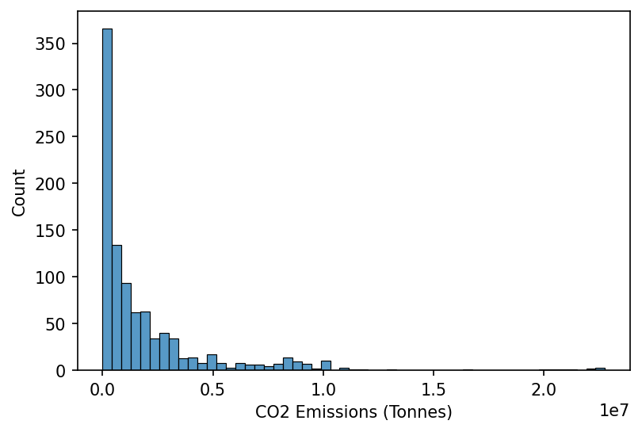
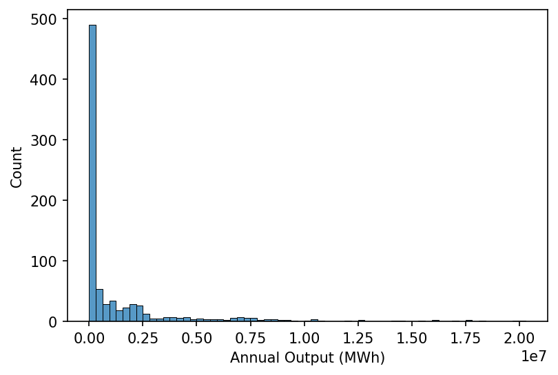

# Carbon Intensity

<br>

### Imports

```python
import numpy as np
import pandas as pd

import seaborn as sns
import matplotlib.pyplot as plt
```

<br>

### Data Preparation

We'll start by loading in the attribute data

```python
attributes_fp = 'https://osuked.github.io/Power-Station-Dictionary/object_attrs/0_dictionary_attributes.csv'

df_attrs = pd.read_csv(attributes_fp)

df_attrs.head()
```

<div>
<style scoped>
    .dataframe tbody tr th:only-of-type {
        vertical-align: middle;
    }

    .dataframe tbody tr th {
        vertical-align: top;
    }

    .dataframe thead th {
        text-align: right;
    }

</style>
<table border="1" class="dataframe">
  <thead>
    <tr style="text-align: right;">
      <th></th>
      <th>attribute</th>
      <th>id</th>
      <th>value</th>
      <th>datapackage</th>
      <th>id_type</th>
      <th>year</th>
      <th>dictionary_id</th>
    </tr>
  </thead>
  <tbody>
    <tr>
      <th>0</th>
      <td>Fuel Type</td>
      <td>MARK-1</td>
      <td>BIOMASS</td>
      <td>https://raw.githubusercontent.com/OSUKED/Dicti...</td>
      <td>ngc_bmu_id</td>
      <td>NaN</td>
      <td>10000</td>
    </tr>
    <tr>
      <th>1</th>
      <td>Longitude</td>
      <td>10000</td>
      <td>-3.603516</td>
      <td>https://raw.githubusercontent.com/OSUKED/Dicti...</td>
      <td>dictionary_id</td>
      <td>NaN</td>
      <td>10000</td>
    </tr>
    <tr>
      <th>2</th>
      <td>Latitude</td>
      <td>10000</td>
      <td>57.480403</td>
      <td>https://raw.githubusercontent.com/OSUKED/Dicti...</td>
      <td>dictionary_id</td>
      <td>NaN</td>
      <td>10000</td>
    </tr>
    <tr>
      <th>3</th>
      <td>Annual Output (MWh)</td>
      <td>MARK-1</td>
      <td>355704.933</td>
      <td>https://raw.githubusercontent.com/OSUKED/Dicti...</td>
      <td>ngc_bmu_id</td>
      <td>2016.0</td>
      <td>10000</td>
    </tr>
    <tr>
      <th>4</th>
      <td>Annual Output (MWh)</td>
      <td>MARK-1</td>
      <td>387311.364</td>
      <td>https://raw.githubusercontent.com/OSUKED/Dicti...</td>
      <td>ngc_bmu_id</td>
      <td>2017.0</td>
      <td>10000</td>
    </tr>
  </tbody>
</table>
</div>

<br>

We'll then extract the CO2 emissions data

```python
co2_attr = 'CO2 Emissions (Tonnes)'

s_site_co2 = (
    df_attrs
    .query('attribute==@co2_attr')
    [['dictionary_id', 'year', 'value']]
    .dropna()
    .astype({'dictionary_id': int, 'year': int, 'value': float})
    .groupby(['dictionary_id', 'year'])
    ['value']
    .sum()
)

# Plotting
fig, ax = plt.subplots(dpi=150)

sns.histplot(s_site_co2, ax=ax)

ax.set_xlabel(co2_attr)
```

    Text(0.5, 0, 'CO2 Emissions (Tonnes)')



<br>

As well as the power output data

```python
output_attr = 'Annual Output (MWh)'

s_site_output = (
    df_attrs
    .query('attribute==@output_attr')
    [['dictionary_id', 'year', 'value']]
    .dropna()
    .astype({'dictionary_id': int, 'year': int, 'value': float})
    .groupby(['dictionary_id', 'year'])
    ['value']
    .sum()
)

# Plotting
fig, ax = plt.subplots(dpi=150)

sns.histplot(s_site_output, ax=ax)

ax.set_xlabel(output_attr)
```

    Text(0.5, 0, 'Annual Output (MWh)')



<br>

And lastly the fuel types of each plant

```python
fuel_attr = 'Fuel Type'

s_site_fuel_type = (
    df_attrs
    .query('attribute==@fuel_attr')
    [['dictionary_id', 'value']]
    .dropna()
    .astype({'dictionary_id': int, 'value': str})
    .groupby('dictionary_id')
    ['value']
    .agg(lambda fuel_types: ', '.join(set(fuel_types)))
)

s_site_fuel_type.value_counts()
```

    WIND                   113
    CCGT                    34
    NPSHYD                  13
    NUCLEAR                  7
    PS                       4
    OCGT                     4
    BIOMASS                  3
    CCGT, OCGT               3
    COAL, CCGT, OCGT         1
    COAL, OCGT               1
    OTHER                    1
    Wind                     1
    COAL, BIOMASS, OCGT      1
    Name: value, dtype: int64

<br>

### Visualising Annual Carbon Intensities

We'll quickly check the data coverage

```python
sites_with_co2_data = s_site_co2.index
sites_with_output_data = s_site_output.index

sites_with_both_datasets = sites_with_co2_data.intersection(sites_with_output_data)

sites_with_co2_data.size, sites_with_output_data.size, sites_with_both_datasets.size
```

    (978, 830, 239)

<br>

And then visualise the annual carbon intensity estimates for OCGT and CCGT plants

```python
def hide_spines(ax, positions=["top", "right"]):
    """
    Pass a matplotlib axis and list of positions with spines to be removed

    args:
        ax:          Matplotlib axis object
        positions:   Python list e.g. ['top', 'bottom']
    """
    assert isinstance(positions, list), "Position must be passed as a list "

    for position in positions:
        ax.spines[position].set_visible(False)
```

```python
ccgt_sites = s_site_fuel_type.index[s_site_fuel_type=='CCGT'].intersection(s_site_co2.index.get_level_values(0)).intersection(s_site_output.index.get_level_values(0))
ocgt_sites = s_site_fuel_type.index[s_site_fuel_type=='OCGT'].intersection(s_site_co2.index.get_level_values(0)).intersection(s_site_output.index.get_level_values(0))

s_ccgt_carbon_intensities = 1000*(s_site_co2.loc[ccgt_sites]/s_site_output.loc[ccgt_sites]).dropna()
s_ccgt_carbon_intensities = s_ccgt_carbon_intensities.loc[(s_ccgt_carbon_intensities<1000)&(s_ccgt_carbon_intensities>200)]

s_ocgt_carbon_intensities = 1000*(s_site_co2.loc[ocgt_sites]/s_site_output.loc[ocgt_sites]).dropna()
s_ocgt_carbon_intensities = s_ocgt_carbon_intensities.loc[(s_ocgt_carbon_intensities<1200)&(s_ocgt_carbon_intensities>200)]

# Plotting
fig, ax = plt.subplots(dpi=150)

sns.histplot(s_ccgt_carbon_intensities, ax=ax, label='CCGT')
sns.histplot(s_ocgt_carbon_intensities, ax=ax, color='C1', label='OCGT')

ax.set_xlabel('Annual Carbon Intensity (gCO2/kWh)')
hide_spines(ax)
ax.legend(frameon=False)
```

    <matplotlib.legend.Legend at 0x1f99c4ba190>


