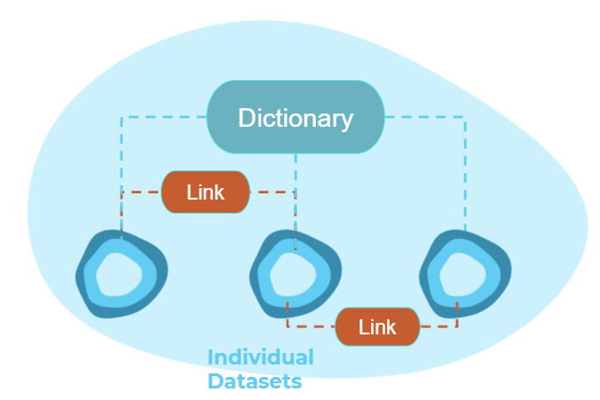

# Welcome to the Power Station Dictionary!

> The *Power Station Dictionary* is a site that enables mapping between various power plant ids and automatically extracts data relating to those plants from Frictionless Data packages.

Power Station Dictionary last updated: *{{ git_site_revision_date_localized }}*

Contributors: [Ayrton Bourn](https://github.com/AyrtonB), [Jessica Steinemann](https://github.com/Jess-St), [Clem Attwood](https://github.com/ClemAtt)

 
 

### Overview

Existing work into increasing the visibility of energy data has focused on improving the ability of humans to find datasets, which has historically been a key issue within a highly fragmented energy data landscape. Groups such as the Energy Data Taskforce have prompted a new wave of metadata standardisation and data cataloguing initiatives which have gone a long way to solving this issue, opening up new opportunities such as the creation of digital twins of the power grid. However, these new opportunities bring new challenges. To enable a digital twin of the energy system we need to be able to ["describe relationships between assets and datasets"](https://docs.google.com/document/d/1X8PIP4f0K2abKjyQiGJQaxdcflQ36GeATBfhJqFevxA), requiring two core extensions to our existing toolset:

1. Field-level metadata that describes the contents of individual columns in a dataset
2. "Mapping" datasets that are able to express the relationships between other datasets

These additions enable us to move from improving the ability of humans to discover datasets to making it easier for machines to automatically find and extract relevant data - a need that will only increase as the number and size of datasets continues to grow. The benefits extend beyond our digital colleagues though - by pivoting data exploration to be about finding objects/assets, which then reveal the datasets (and attributes) they are linked to, we can create a more intuitive search experience. Similar to Google’s move from searching for ["Things not Strings"](https://blog.google/products/search/introducing-knowledge-graph-things-not/), the data dictionary lets us search for "Assets not Datasets".

To illustrate the benefits of such a framework we are building a pilot dictionary focused on improving the discoverability, linkage, and automated extraction of data relating to power stations on the GB system. Power stations were chosen due to the high number of datasets they relate to, the wide range of ids used to describe them, and the current duplication in efforts to link them across industry and academia. We will then demonstrate how the dictionary can be used for analysis with two case studies: one researching the carbon intensity of individual generators by matching power output and carbon emission datasets, the second linking wholesale price and renewable subsidy data to help explain why wind subsidies have fallen below the average market price.

You can read more about why we've created the dictionary and how it works in [this blog post](blog/launch).